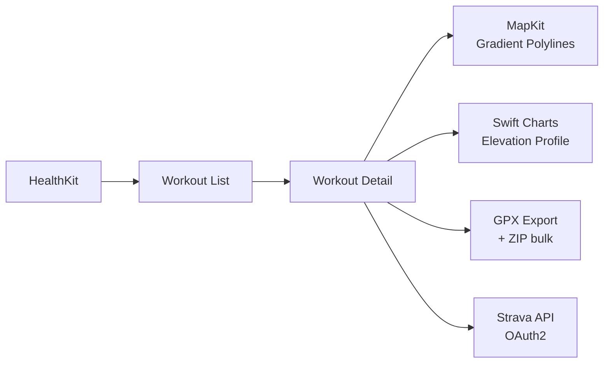
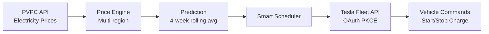
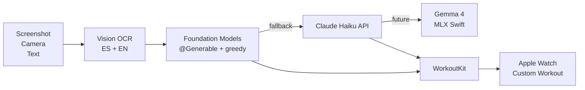

# Hola, I'm Luis 👋

**Senior iOS Engineer** with 14+ years of experience building iOS apps.

I spent nearly 10 years at [Ocado Technology](https://github.com/ocadotechnology), contributing to **Ocado Smart Platform** — a modular, multi-tenant e-commerce platform with iOS build targets for 12 retailers across 10+ markets (Aeon, Alcampo, Auchan, Bon Preu, ICA, Lotte, Monoprix, Morrisons, Naturalia, Panda, Voila and Zoom). There I worked on everything from design systems, monetisation features, and accessibility to large-scale technical migrations (Objective-C → Swift, UIKit → SwiftUI, RxSwift → async/await).

Outside of work, I also build my own projects, driven by two things I care about: **nature and technology**. I use AI as a multiplier across every phase — architecture, design, implementation, testing, localization, and even App Store preparation. It's been a transformative journey.

---

## 🏔️ Projects

> Repos are private — TestFlight builds and demos available on request.

SnapGPX is a mature, production-ready project I'm preparing for the App Store. SmartCharge and PlanToWatch are proof-of-concept explorations to validate the feasibility of each idea.

### SnapGPX 📍
**Export your Apple Health workouts to GPX — individually or in bulk.**

Born from my love for outdoor activities, SnapGPX lets you visualize routes with gradient polylines, explore elevation charts, merge multi-segment routes into a single track, and export multi-sport workouts to Strava individually. Supports 11 languages. Heading toward App Store release.

`iOS 26+` `Swift 6` `SwiftUI` `MVVM` `HealthKit` `MapKit` `Swift Charts` `Strava API`

🧪 Unit tests · UI tests · Accessibility · Design system · CI/CD (GitHub Actions + Xcode Cloud) 
🤖 AI-driven development across every phase: architecture, design, implementation, testing, localization, market research, App Store copy

🔗 [snapgpx.github.io](https://snapgpx.github.io)

Architecture & technical details

- **Feature-based architecture** with custom design system (semantic tokens for colors, typography, spacing, theming)
- **HealthKit** async queries via `withCheckedContinuation`
- **Gradient polylines** for merged multi-segment route visualization
- **GPX export** with ZIP packaging for bulk exports
- **Strava OAuth2** integration with individual multi-sport workout export
- **UI Tests** with Page Object Model pattern + `AccessibilityID` constants
- **Pre-push hooks** enforcing coverage thresholds (ViewModels ≥85%, Utilities ≥80%)
- **8 documented rule files** guiding AI-assisted development (localization, git workflow, testing standards, design system, coding patterns, UI testing, CI/CD)

### SmartCharge ⚡
**Intelligent EV charging for Tesla — charge smarter, not harder.**

I wanted my Tesla to charge at the cheapest hours without me having to think about it. SmartCharge optimizes for the lowest electricity prices (Spanish PVPC tariff), adapts to your usage patterns, and schedules charging automatically while keeping battery health in mind.

`Swift` `SwiftUI` `async/await` `MVVM` `Tesla Fleet API` `OAuth PKCE` `Vehicle Command Protocol`

🧪 125 unit tests · Zero external dependencies

Architecture & technical details

- **Tesla Fleet API** end-to-end: OAuth PKCE + tokens in Keychain + Vehicle Command Protocol via proxy
- **Auto wake-up** with retry logic when the vehicle is offline
- **PVPC multi-region** pricing: Peninsula, Canary Islands, Balearic Islands, Ceuta, Melilla
- **Price prediction** using 4-week rolling average from historical data
- **Zero external dependencies** — pure Apple frameworks only

### PlanToWatch ⌚
**From natural language to Apple Watch Custom Workouts.**

A weekend idea that turned into an exploration of on-device AI. Take a screenshot of your training plan from any coaching app, and PlanToWatch uses Apple's Foundation Models to parse it into a structured workout that syncs to your Apple Watch via WorkoutKit.

`Swift 6` `SwiftUI` `WorkoutKit` `Foundation Models` `Vision OCR`

🧠 On-device AI with `@Generable` + greedy sampling · Parser escalation: Foundation Models → Claude Haiku → (future) Gemma 4 via MLX Swift

Architecture & technical details

- **Parser escalation strategy**: 3 levels — on-device Foundation Models (free) → Claude Haiku API (fallback) → future Gemma 4 via MLX Swift
- **`@Generable` structs** with `@Guide` constraints using `anyOf()` and `.range()` for structured output
- **Greedy sampling** for deterministic, reproducible parsing
- **Two workout types**: intervals (sets + recovery periods) and continuous (steady-state distance goals)
- **Vision OCR** with bilingual support (Spanish + English)

---

## 🧭 The AI Journey

AI-augmented development is still new territory for all of us. Over the past year, I've been learning by doing — exploring the possibilities, hitting the limits, and iterating until things work.

SnapGPX has been my main playground. What started as a side project became a full exploration of what's possible when AI participates in every phase of development — not just writing code, but shaping architecture, designing a design system, setting up CI/CD, localizing to 11 languages, and even preparing App Store copy. 318 commits later, the codebase has 38K lines of Swift across 194 files, with 93 refactoring passes, 578 tests (unit + UI), and 8 documented rule files that guide how AI and I collaborate.

One area where AI has been especially valuable is third-party API integration. Navigating the Strava API and Tesla Fleet API — with their OAuth flows and edge cases — became significantly faster with AI assistance. What used to take days of reading docs and trial-and-error now flows much more naturally.

Along the way, I've gone through several iterations of skills, hooks, agents, and agent teams — learning what works and what doesn't. That experience led me to build **[claude-code-ios-template](https://github.com/buca1821/claude-code-ios-template)** and **[claude-marketplace](https://github.com/buca1821/claude-marketplace)** to package what I've learned into reusable tools.

SmartCharge (105 commits, 125 tests) and PlanToWatch (built in 6 days from idea to working prototype) each taught me something different — from integrating complex third-party APIs with AI assistance to exploring on-device Foundation Models.

This isn't about replacing engineering judgment — it's about amplifying it. The craft still matters. The AI just lets you go further.

---

## 🛠️ Tech Stack

**Languages:** Swift · Objective-C (legacy) 
**UI:** SwiftUI · UIKit 
**Architecture:** MVVM · Clean Architecture · Modular SPM (50+ feature modules) · Dependency Injection · Coordinators 
**Concurrency:** async/await · Combine · RxSwift (legacy) · GCD 
**Networking:** URLSession + async/await · Third-party API integration (Strava, Tesla Fleet) 
**Persistence:** UserDefaults · Keychain 
**Apple Frameworks:** HealthKit · MapKit · Swift Charts · WorkoutKit · Foundation Models · Vision (OCR) 
**Platform:** Push notifications (APNs) · Deep linking / Universal Links · Biometric auth (FaceID/TouchID) · Advanced localisation (String Catalogs) 
**Analytics:** Firebase Analytics · Crashlytics · VantageSDK 
**Testing:** Swift Testing · XCTest · Snapshot Testing · Integration Tests 
**Tooling:** Xcode · Git (GitHub, GitLab) · Fastlane · SPM 
**CI/CD:** GitLab CI · GitHub Actions · Xcode Cloud 
**AI:** Claude Code (skills/hooks/agents/plugins) · Cursor · Gemini CLI · GitHub Copilot

---

## 📬 Let's connect

I'm always happy to collaborate on meaningful projects where craft and quality matter. I'm especially excited about what AI is bringing to our field — it's changing how we build, and I want to be part of that conversation. Whether it's iOS, AI-augmented development, or just swapping trail stories, feel free to reach out.

